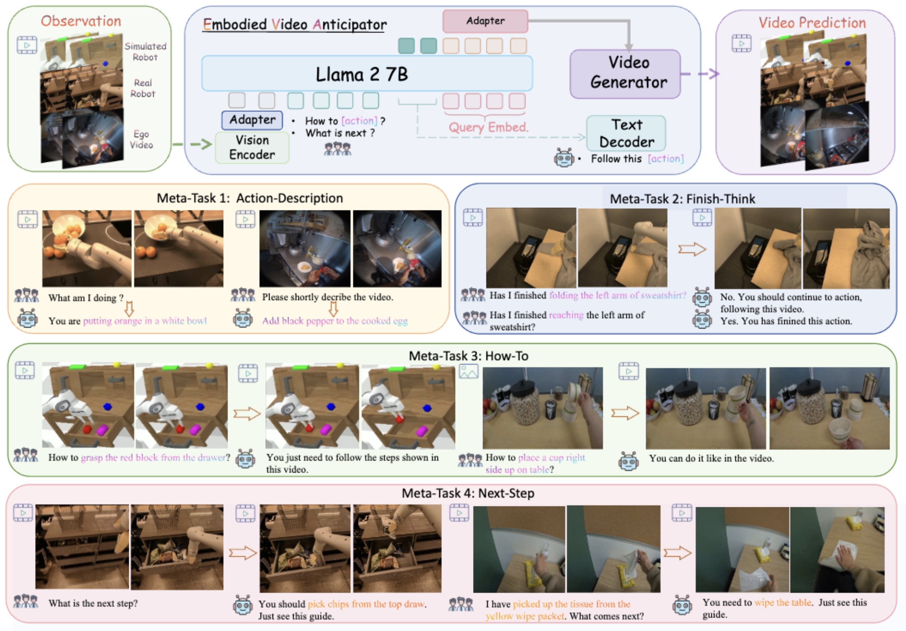

# ___***EVA: An Embodied World Model for Future Video Anticipation***___

<div align="center">
</img>
      
Xiaowei Chi*, Hengyuan Zhang*, Chun-Kai Fan*, Xingqun Qi, Rongyu Zhang, Anthony Chen, Chi-min Chan, Wei Xue, Wenhan Luo, 
Shanghang Zhang, Yike Guo
<br>
Hong Kong University of Science and Technology, 
Peking University

_**[](https://arxiv.org/abs/2410.15461)
[](https://sites.google.com/view/eva-public)**_

</div>

## Abstract
World models integrate raw data from various modalities—such as images and language to simulate comprehensive interactions in the world, thereby displaying crucial roles in fields like mixed reality and robotics. Yet, applying the world model for accurate video prediction is quite challenging due to the complex and dynamic intentions of the various scenes in practice. In this paper, inspired by the human rethinking process, we decompose the complex video prediction into four meta-tasks that enable the world model to handle this issue in a more fine-grained manner. Alongside these tasks, we introduce a new benchmark named Embodied Video Anticipation Benchmark (EVA-Bench) to provide a well-rounded evaluation. EVA-Bench focused on evaluating the video prediction ability of human and robot actions, presenting significant challenges for both the language model and the generation model. Targeting embodied video prediction, we propose the Embodied Video Anticipator (EVA), a unified framework aiming at video understanding and generation. EVA integrates a video generation model with a visual language model, effectively combining reasoning capabilities with high-quality generation. Moreover, to enhance the generalization of our framework, we tailor-designed a multi-stage pretraining paradigm that adaptatively ensembles LoRA to produce high-fidelity results.  Extensive experiments on EVA-Bench highlight the potential of EVA to significantly improve performance in embodied scenes, paving the way for large-scale pre-trained models in real-world prediction tasks.

<div align='center'>

</div>


## Open-Source Plan
- [ ] EVA-2Stage Code.
- [ ] EVA-QA dataset
- [ ] Text-to-Video dataset 
- [ ] RTX-to-Video, CALVIN-to-Video data process scripts


## Cite EVA
```
@misc{chi2024evaembodiedworldmodel,
      title={EVA: An Embodied World Model for Future Video Anticipation}, 
      author={Xiaowei Chi and Hengyuan Zhang and Chun-Kai Fan and Xingqun Qi and Rongyu Zhang and Anthony Chen and Chi-min Chan and Wei Xue and Wenhan Luo and Shanghang Zhang and Yike Guo},
      year={2024},
      eprint={2410.15461},
      archivePrefix={arXiv},
      primaryClass={cs.CV},
      url={https://arxiv.org/abs/2410.15461}, 
}
```
